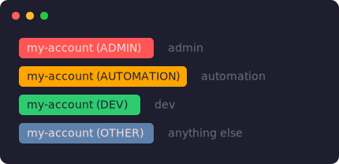

# approov-prompt

> **Disclaimer:** This is a personal project. It is **not** an official Approov
> product and is not affiliated with, endorsed by, or supported by Approov.
> It only reads the `APPROOV_ROLE` environment variable the Approov CLI
> already sets; it never talks to Approov. Use at your own discretion.

Show your active [Approov](https://approov.io/) account and role as a
colour-coded badge in your shell prompt, so you can tell at a glance which
account your commands are about to hit — and notice immediately when you're in
`admin`.



## How it works

The Approov CLI selects a role against an account:

```sh
eval "$(approov role <role> <account>)"      # Unix shells
set APPROOV_ROLE=<role>:<account>            # Windows (cmd)
$env:APPROOV_ROLE = '<role>:<account>'       # Windows (PowerShell)
```

This exports `APPROOV_ROLE` in the form `role:account`. Each snippet here reads
that variable and renders an `account (ROLE)` badge, coloured by role:

| Role          | Colour |
| ------------- | ------ |
| `admin`       | red    |
| `automation`  | orange |
| `dev`         | green  |
| anything else | blue   |

When `APPROOV_ROLE` is unset, the badge renders nothing.

```sh
eval "$(approov role admin my-account)"   # my-account (ADMIN), red badge
eval "$(approov role dev   my-account)"   # my-account (DEV),   green badge
```

## Pick your prompt

These are copy-paste snippets, one per prompt tool — there's no installer and
nothing to depend on. Grab the directory for your setup:

| Prompt tool                                               | Snippet                          | Status                              |
| --------------------------------------------------------- | -------------------------------- | ----------------------------------- |
| [oh-my-posh](https://ohmyposh.dev/)                       | [oh-my-posh/](oh-my-posh/)       | Verified                            |
| zsh (no framework)                                        | [zsh/](zsh/)                      | Verified                            |
| bash                                                      | [bash/](bash/)                   | Verified                            |
| [starship](https://starship.rs/)                          | [starship/](starship/)           | Needs verification     |
| [powerlevel10k](https://github.com/romkatv/powerlevel10k) | [powerlevel10k/](powerlevel10k/) | Needs verification    |
| [fish](https://fishshell.com/)                            | [fish/](fish/)                   | Needs verification                  |
| PowerShell                                                | [powershell/](powershell/)       | Needs verification                  |

Each directory has its own README with install steps and a verify command. The
colours assume a dark background and use the same palette throughout; tweak the
hex values to suit your theme.

## Does it work in your shell?

The **Status** column above is a cry for help: the snippets were authored on macOS:
only oh-my-posh, zsh, and bash have been run end-to-end. The rest are written to
each tool's documented conventions but haven't been rendered on a real prompt.

If you run one of the untested snippets - or just use a shell that isn't listed -
please confirm it works and let me know. Even a one-line "verified on fish 3.7,
macOS" is really helpful.

See **[CONTRIBUTING.md](CONTRIBUTING.md)** for how to verify a snippet, what the
badge should look like for each role, and how to add a new shell.

## License

[MIT](LICENSE)
